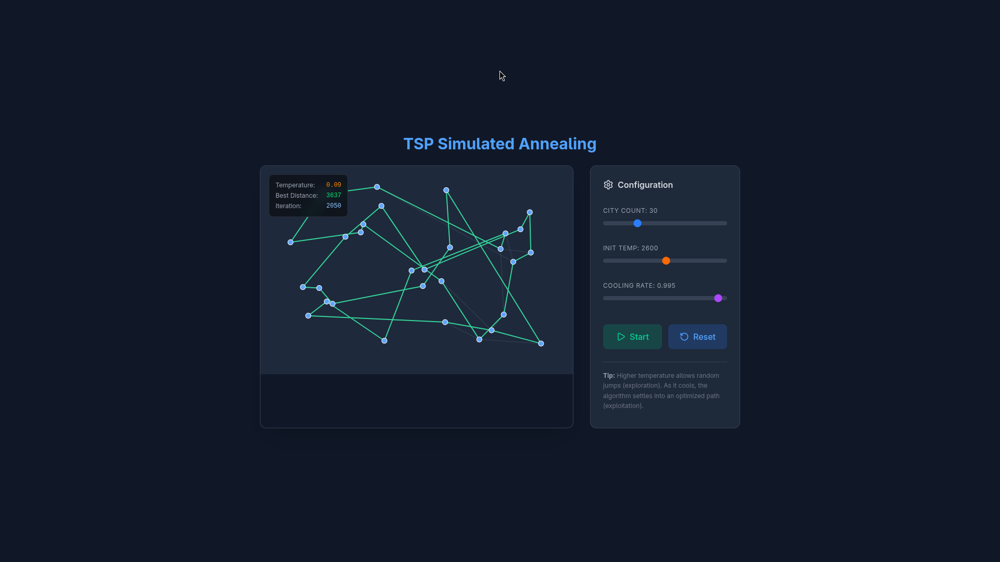

# TSP Visualizer — Simulated Annealing

A small interactive React + Vite app that demonstrates solving the Traveling Salesman Problem (TSP) using the Simulated Annealing algorithm. The app visualizes cities and shows the current and best routes as the algorithm runs.

## Demo

Place a screenshot or animated GIF named `demo.png` in the `public/` folder of this repository, then the image below will render on GitHub and in the project docs:



## Quick setup

Prerequisites

- Node.js 18+ (or a current LTS). NPM comes with Node. You can also use Yarn or PNPM, but the examples below use npm.

Install dependencies

```bash
npm install
```

Run the dev server (Vite)

```bash
npm run dev
```

Open http://localhost:5173 in your browser (Vite's default port) to view the visualizer.

Build for production

```bash
npm run build
```

Preview a production build locally

```bash
npm run preview
```

## How to use the app

- Use the sliders to change the number of cities, the initial temperature and the cooling rate.
- Click Start to run the Simulated Annealing solver. Click Pause to stop it temporarily.
- Click Reset to generate a new random set of cities and reset the algorithm.
- The left canvas shows the current path (faint lines) and the best path found so far (highlighted). An overlay shows Temperature, Best Distance and Iteration count.

## Where to put `demo.png`

Put your example screenshot or animated GIF named `demo.png` in the `public/` folder in this repo (i.e. `public/demo.png`). That file path is referenced above and will display correctly on GitHub when viewing the README.

Example (from repo root):

```text
public/demo.png
```

If you prefer to keep images in `src/assets/`, change the reference above to `src/assets/demo.png` and update the path accordingly — however placing it in `public/` keeps the README reference and runtime asset URL consistent.

## Relevant scripts (from package.json)

- `npm run dev` — start Vite dev server (hot reload)
- `npm run build` — build a production bundle
- `npm run preview` — preview the production build locally

## A brief explanation — Simulated Annealing for TSP

Simulated Annealing (SA) is a probabilistic optimization technique inspired by the physical annealing process in metallurgy. For TSP, it searches for a short route visiting all cities exactly once and returning to the start.

How this implementation works (high-level):

1. Representation: a route (permutation) of city indices is the current solution.
2. Initialization: start from a random permutation and measure its total distance (energy).
3. Neighbor generation: produce a neighbor solution by swapping two cities in the current route.
4. Acceptance rule: compute the distance difference Δ = newDistance − currentDistance.
   - If Δ ≤ 0 (new route is shorter), accept the neighbor (greedy improvement).
   - If Δ > 0 (worse), accept the neighbor with probability exp(−Δ / T), where T is the current temperature. This allows escaping local minima.
5. Cooling: gradually reduce the temperature T ← T × coolingRate (a factor slightly below 1). Repeat steps 3–5 until T is sufficiently small or a max iteration count is reached.

Key parameters and their effects:

- Initial Temperature (T0): larger values increase exploration early on and make it likelier to accept worse moves initially.
- Cooling Rate (α): a multiplicative factor (e.g., 0.995). Values closer to 1 cool slower and allow more thorough search, but take longer.
- Neighbor operator: swapping two cities is simple and effective; other operators (2-opt, 3-opt) may improve convergence.

Why SA works for TSP

SA balances exploration and exploitation using temperature-controlled randomness. Early on (high T) it explores widely and can cross high-energy barriers; later (low T) it focuses on fine-tuning near good solutions. The occasional acceptance of worse solutions is what helps it avoid getting trapped in poor local minima.

## Notes and troubleshooting

- If the canvas appears blank, confirm you opened the correct port and that dependencies installed successfully.
- To get faster convergence for larger city counts, try increasing the number of algorithm steps per animation frame or use a more powerful neighbor operator (like 2-opt).

---

If you'd like, I can:

- add an example `public/demo.png` (you can provide one),
- include a short GIF instead of a static PNG, or
- add a small CONTRIBUTING or USAGE section with tips for parameter tuning.

Happy exploring!

# React + Vite

This template provides a minimal setup to get React working in Vite with HMR and some ESLint rules.

Currently, two official plugins are available:

- [@vitejs/plugin-react](https://github.com/vitejs/vite-plugin-react/blob/main/packages/plugin-react) uses [Babel](https://babeljs.io/) (or [oxc](https://oxc.rs) when used in [rolldown-vite](https://vite.dev/guide/rolldown)) for Fast Refresh
- [@vitejs/plugin-react-swc](https://github.com/vitejs/vite-plugin-react/blob/main/packages/plugin-react-swc) uses [SWC](https://swc.rs/) for Fast Refresh

## React Compiler

The React Compiler is not enabled on this template because of its impact on dev & build performances. To add it, see [this documentation](https://react.dev/learn/react-compiler/installation).

## Expanding the ESLint configuration

If you are developing a production application, we recommend using TypeScript with type-aware lint rules enabled. Check out the [TS template](https://github.com/vitejs/vite/tree/main/packages/create-vite/template-react-ts) for information on how to integrate TypeScript and [`typescript-eslint`](https://typescript-eslint.io) in your project.
